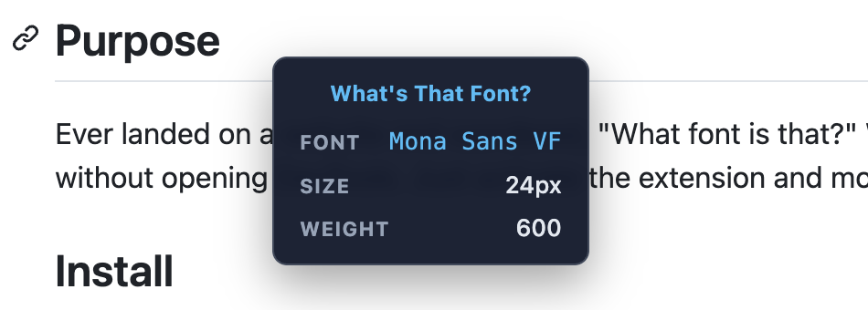

# What's That Font?

A Google Chrome extension that shows a tooltip with the font family, font size, and font weight of whatever page element your cursor is currently hovering over.

## Purpose

Ever landed on a website and wondered, "What font is that?" **What's That Font** lets you quickly inspect typography without opening DevTools. Just activate the extension and move your mouse over the text you want to identify.

## Install

This extension is not yet published to the Chrome web store, so you must install it locally.

1. Open `chrome://extensions` in Google Chrome.
2. Enable **Developer mode** in the top-right toggle.
3. Click **Load unpacked** and select the extension directory.

## Usage

1. Visit any webpage.
2. Click the **What's That Font** toolbar icon (or press `Ctrl+Shift+F` / `Cmd+Shift+F`).
3. Hover over any element to see its font details in a tooltip.
4. Click the icon again (or press the shortcut) to deactivate.

## License

GPL v3 — see [LICENSE](LICENSE) for details.

## Author

**Russell Dickenson** — [GitHub](https://github.com/russelldickenson)