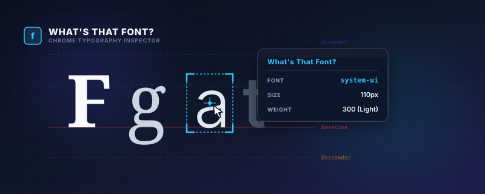

  

  
  
  

---

# What's That Font?

A lightweight Google Chrome extension that lets you inspect the typography of any element on a webpage instantly on hover.

---

## 🎯 Purpose

Ever landed on a website and wondered, **"What font is that?"** 

**What's That Font** allows designers, developers, and typography enthusiasts to quickly inspect typography details without having to open the Chrome DevTools. Simply activate the extension and hover over any text to view its details in a sleek cursor-following tooltip.

---

## 🚀 Key Features

*   **Live Hover Inspection**: Move your cursor over any element to see its typography details instantly.
*   **⌨️ Keyboard Toggle**: Easily toggle the inspector on/off using the `Ctrl+Shift+F` (or `Cmd+Shift+F` on Mac) shortcut.
*   **💡 Accurate Font Resolution**: Displays the computed font-family (showing the first fallback option), font-size, and font-weight.
*   **✨ Sleek Glassmorphic UI**: Uses a modern dark tooltip with a backdrop-blur effect that stays out of the way.
*   **🔔 Action Feedback**: Displays a toast notification letting you know when the inspector is enabled or disabled.

---

## 📸 Preview

Here is the extension in action, displaying font family, size, and weight:

  

---

## 📦 Installation

Since this extension is not yet published to the Chrome Web Store, you can install it locally as a developer extension:

1.  Clone or download this repository to your local machine.
2.  Open **Google Chrome** and navigate to `chrome://extensions`.
3.  Enable **Developer mode** using the toggle switch in the top-right corner.
4.  Click the **Load unpacked** button in the top-left corner.
5.  Select the directory containing the extension files.

---

## 🛠️ Usage

1.  Navigate to any webpage.
2.  Activate the inspector by:
    *   Clicking the **What's That Font** icon in the toolbar.
    *   Using the shortcut `Ctrl+Shift+F` (Windows/Linux) or `Cmd+Shift+F` (macOS).
3.  Hover over any text element to inspect its typography.
4.  To deactivate, click the extension icon or use the shortcut again.

---

## 📄 License

GPL v3 — see [LICENSE](LICENSE) for details.

---

## ✍️ Author

**Russell Dickenson** — [GitHub](https://github.com/russelldickenson)